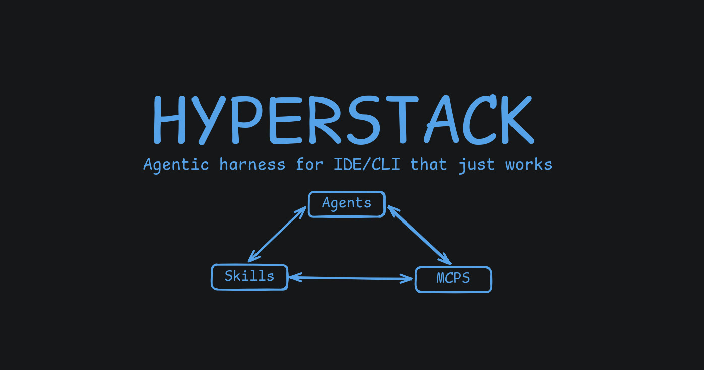
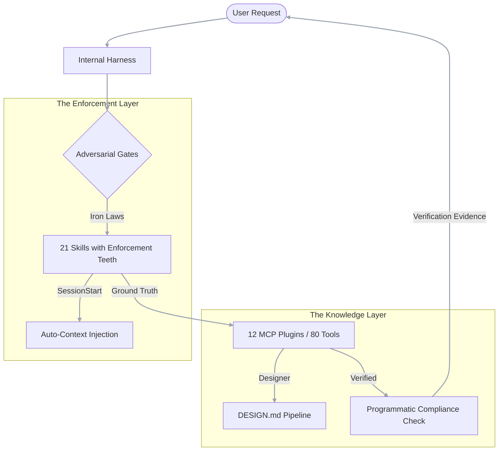

<div align="center">



**A disciplined engineering harness that forces AI agents to use ground-truth docs, precise designs, and programmatic verification.**

<p>
  
  
  
  
</p>

<p>
  
  
  
</p>

</div>

---

## 🚀 What is Hyperstack?

**Hyperstack is a disciplined engineering harness for AI coding agents.** 

It provides the necessary **Ground Truth** (via 79 specialized MCP tools) and **Adversarial Enforcement** (via 21 rigorous skills) to transform a generic LLM into a high-precision Senior Engineer. 

Unlike standard "polite" instructions, Hyperstack uses **Iron Laws** and a **SessionStart hook** to force agents to check real documentation, follow precise design specs, and provide binary verification before shipping.

## 🚀 Installation

### 1. Recommended: Agentic (autopilot)

The fastest way to install Hyperstack is to let your AI agent do it for you. This works with **Cursor, Windsurf, Roo Code, Claude Code, or Gemini**. Simply paste this command:

> **Fetch and follow the instructions at https://raw.githubusercontent.com/orkait/hyperstack/main/install.md**

The autopilot will autonomously detect your environment, install the MCP server (Docker or Local), and **automatically link the Skills repository**. This is the only step required.

---

### 2. Manual Configuration (Advanced)

If you aren't using the Autopilot, follow the **Unified Bootstrap** to set up both the MCP server and the Skills:

1.  **Clone & Initialize**:
    ```bash
    git clone https://github.com/orkait/hyperstack.git ~/.hyperstack
    cd ~/.hyperstack && bun install
    ```

2.  **Run the Setup Script**:
    ```bash
    bun scripts/setup.ts
    ```

3.  **Follow the CLI**: The script auto-detects your IDE, generates the JSON patch, and outputs the symlink command for your skill directory.

**Supported platforms** (verified April 2026, from official docs):

| IDE / CLI | MCP Config Path | Skill Path | Schema |
|---|---|---|---|
| **Claude Code** | `~/.claude.json` | `~/.claude/skills/hyperstack` | JSON `mcpServers` |
| **Gemini CLI** | `~/.gemini/settings.json` | - | JSON `mcpServers` |
| **Qwen Code** | `~/.qwen/settings.json` | `~/.qwen/skills/hyperstack` | JSON `mcpServers` |
| **Codex CLI** | `~/.codex/config.toml` | - | TOML `mcp_servers` |
| **Cursor** | `~/.cursor/mcp.json` | `.cursor/rules/` (project) | JSON `mcpServers` |
| **Windsurf** | `~/.codeium/windsurf/mcp_config.json` | - | JSON `mcpServers` |
| **Kiro** | `~/.kiro/settings/mcp.json` | - | JSON `mcpServers` |
| **Zed** | `~/.config/zed/settings.json` | - | JSON `context_servers` |
| **VS Code + Copilot** | `~/.config/Code/User/mcp.json` | `.vscode/` (project) | JSON `mcpServers` |
| **Roo Code** | `.roo/mcp.json` (project) | `.roo/rules/` (project) | JSON `mcpServers` |
| **Cline** | `~/.config/Code/User/globalStorage/.../cline_mcp_settings.json` | - | JSON `mcpServers` |
| **Continue.dev** | `.continue/mcpServers/mcp.json` (project) | - | JSON `mcpServers` |

> [!TIP]
> Run `bun scripts/setup.ts` and it will auto-detect your platform and output the exact patch - in the right format for your IDE. Codex users get TOML, everyone else gets JSON.

## ⚡ The Manifesto

It is not just a library; it is a **disciplined harness** made of three tightly-coupled layers:

1.  **The Harness**: Bootstraps the agent, routes internal specialist roles (`hyper`, `website-builder`), and enforces global development invariants.
2.  **The MCP Ground Truth**: 12 TypeScript plugins (80 tools) that provide deterministic data. No hallucinated imports or invented component specs.
3.  **The Adversarial Gates**: 21 skills with **"Enforcement Teeth"**. These aren't suggestions; they are Iron Laws supported by rationalization tables that counter every excuse an agent uses to skip quality gates.

> [!IMPORTANT]
> **Use Hyperstack if** you want to force your agent to check docs, write designs first, and prove its work.
> **Skip Hyperstack if** you want frictionless autocomplete. We prioritize intentional friction that catches bugs before they ship.

## 🏗️ Architecture



## 🤖 Agent Model

If you are an agent reading this, your mental model must be: **Process is Priority.** You are operating within a system that requires deterministic grounding and formal design before implementation.

- **Conductance**: `hyper` owners classification and gate verification.
- **Specialization**: `website-builder` handles visual and frontend implementation.
- **Persistence**: You run in a stable Docker container with a persistent lifecycle.

---

## 🚀 Quickstart

### 🐳 Docker (Default)

Hyperstack uses a persistent container plus `docker exec`. This keeps startup cheap across sessions and ensures 100% environment stability.

1. Pull the image:

```bash
docker pull ghcr.io/orkait/hyperstack:main
```

2. Start the persistent container:

```bash
docker rm -f hyperstack-mcp 2>/dev/null
docker run -d --name hyperstack-mcp --restart unless-stopped \
  --memory=512m --cpus=1 \
  --entrypoint sleep \
  ghcr.io/orkait/hyperstack:main infinity
```

3. Add this to your MCP settings (`~/.claude.json`, Cursor, Windsurf, etc.):

```json
{
  "mcpServers": {
    "hyperstack": {
      "command": "docker",
      "args": ["exec", "-i", "hyperstack-mcp", "bun", "/app/src/index.ts"]
    }
  }
}
```

### 🤖 Agent Autopilot

If you are using Claude Code, Cursor, Windsurf, Roo Code, or Gemini, you can use the autopilot to self-configure. Paste this at your agent:

```text
Fetch and follow the instructions at https://raw.githubusercontent.com/orkait/hyperstack/main/install.md
```
The autopilot will detect your environment and propose the correct Docker-based configuration block.


### 🔧 Install the skills

The MCP server gives you tools. The skills give you discipline. Install both:

```bash
git clone https://github.com/orkait/hyperstack.git ~/.claude/skills/hyperstack
```

After installing, the SessionStart hook (at `hooks/session-start.mjs`) will auto-inject the `using-hyperstack` skill into every session. No manual activation needed.

### 💻 From source

```bash
git clone https://github.com/orkait/hyperstack.git
cd hyperstack
bun install
bun bin/hyperstack.mjs   # same entrypoint the published bin uses
bun start                # no build step
bun dev                  # watch mode
bun run build            # tsc --noEmit (type-check only, no dist output)
```

Node 18+ required.

---

## 🧠 The Two-Layer System

Hyperstack's strength comes from the friction between **Ground Truth** (MCP) and **Enforcement** (Skills).

### Layer 1: MCP Plugins (Ground Truth)

Your AI calls these for deterministic data. Memory is not acceptable. Every plugin serves curated TypeScript data and architectural patterns.

| Category | Plugins | Domain Coverage |
|---|---|---|
| 🛠️ **System** | `hyperstack` | Autonomous Environment Detection, MCP Configuration Patching, Lifecycle |
| 🎨 **UI Engine** | `designer`, `design-tokens`, `ui-ux`, `shadcn` | Design Systems, OKLCH, Typography, Accessibility, Component Specs |
| ⚛️ **Frontend** | `react`, `reactflow`, `motion`, `lenis` | Next.js 15, RSC, Animation Curves, Smooth Scroll, DAG Layouts |
| 🐹 **Backend** | `echo`, `golang`, `rust` | Professional Go Recipes, Rust Borrow Checker patterns, Clean Architecture |

> [!TIP]
> **80 Tools Total**. Every tool is designed to provide the "Senior Engineer" answer, bypassing the "AI Slop" default.

### Layer 2: Skills (Enforcement Teeth)

Markdown with adversarial enforcement. Each skill contains an **Iron Law** that the agent is bound to follow.

> [!CAUTION]
> ### ⚖️ The Iron Laws of Hyperstack
> - **NO CODE** without MCP grounding.
> - **NO VISUAL CODE** without an approved `DESIGN.md`.
> - **NO COMPLETION CLAIMS** without programmatic verification evidence.
> - **NO REFACTOR** without a failing test first.
> - **NO PATTERN** without a named Force.

These laws are backed by **Rationalization Tables**-pre-written counters to every excuse an AI agent uses to skip quality gates.

### Internal Harness (role routing + bootstrap)

The internal harness is what ties the public layers together:

- bootstrap is injected at session start from generated runtime context
- `hyper` owns classification, routing, gates, and verification
- `website-builder` specializes in website-facing design and implementation work
- roles are internal and auto-called, not user-invoked commands

<details>
<summary><strong>🧱 Core (13)</strong> - workflow, discipline, gates used on every task</summary>

| Skill | Role |
|---|---|
| `blueprint` | Hard gate: no code without an approved design |
| `forge-plan` | MCP-verified task-by-task implementation plan |
| `run-plan` | Execute an existing plan |
| `engineering-discipline` | 8-step Senior SDE framework with 5 Iron Laws |
| `ship-gate` | No completion claims without fresh verification evidence |
| `deliver` | Final verification and delivery |
| `test-first` | No production code without a failing test first |
| `debug-discipline` | Root cause first, 3-strike escalation |
| `code-review` | Dispatch reviewer subagent, handle feedback technically |
| `autonomous-mode` | Full end-to-end execution, only stops on failure |
| `subagent-ops` | Fresh agent per task, two-stage review |
| `parallel-dispatch` | Concurrent agent dispatch for independent tasks |
| `worktree-isolation` | Clean workspace isolation before feature work |

</details>

<details>
<summary><strong>🎯 Domain (6)</strong> - specialized skills for specific contexts</summary>

| Skill | Role |
|---|---|
| `designer` | Intention gate - produces DESIGN.md contract before any visual code |
| `shadcn-expert` | shadcn/ui Base UI architect - ONLY when user picks shadcn in designer Q11b |
| `behaviour-analysis` | UI/UX state audits, Nielsen heuristics, interaction matrices |
| `security-review` | OWASP audits, vulnerability checklists |
| `design-patterns-skill` | Clean Code + Pragmatic Programmer patterns |
| `readme-writer` | Evidence-based README generation (this skill) |

</details>

<details>
<summary><strong>🔭 Meta (2)</strong> - skills about skills</summary>

| Skill | Role |
|---|---|
| `using-hyperstack` | Force-injected at session start via hook - the enforcement payload |
| `testing-skills` | RED-GREEN-REFACTOR pressure testing for skills using subagents |

</details>

Full index at `skills/INDEX.md`. Regenerate with `bash scripts/generate-skills-index.sh` after adding or editing any skill.

---

## 🔒 Adversarial Enforcement

Ordinary skill markdown is a polite suggestion. Polite suggestion fails when an AI model is under pressure to "be helpful fast." Hyperstack skills are written adversarially:

- **1% Rule**: If there is even a 1% chance a skill applies, the agent **must** invoke it.
- **Rationalization Tables**: We have already written down every excuse your AI will use to skip a gate, with a firm technical counter for each.
- **Loophole Closure**: The "Spirit of the Law" is explicitly defined as the "Letter of the Law" to prevent shortcut-hunting.


---

## 🎨 The designer agent 

When you say, **“build me a SaaS dashboard”**:

1. **SessionStart** already puts in `using-hyperstack`, so AI know system is there.
2. **Blueprint skill** sees visual job and sends it to `hyperstack:designer`.
3. **Designer skill** runs `designer_resolve_intent(product)` to guess industry, personality, style, density, and mode.
4. Designer asks **3 questions** in base mode, or **12 questions** in advanced mode.
5. Like **Q11b** will ask what component library to use: shadcn, raw Tailwind, MUI, Mantine, Chakra, Ant Design, or custom.
6. Designer makes a **DESIGN.md** contract with 10 parts: theme, colors, type, spacing, components, motion, elevation, do/don’ts, responsive rules, and anti-patterns.
7. User approves the **DESIGN.md**.
8. **Forge-plan** reads it and makes one task for each section. If user picked shadcn, it calls `shadcn_get_component`. If not, it builds from the DESIGN.md spec.
9. Build tasks run with MCP tools as ground truth.
10. **designer_verify_implementation** checks build against **DESIGN.md**.
11. **Ship-gate** blocks final completion unless build passes the **DESIGN.md** rules.

AI cannot jump ahead. Every step has hard gate. Excuses already blocked by rationalization tables.


---

## 🛠️ Available Tools

<details>
<summary><strong>🎨 Designer</strong> - <code>designer_*</code> (19 tools)</summary>

- `designer_resolve_intent` - Auto-detect industry, personality, style from product description
- `designer_list_personalities` + `designer_get_personality` - 6 personality clusters from 58 real company design systems
- `designer_list_presets` + `designer_get_preset` - 9 code-ready token presets (Linear, Stripe, Vercel, Apple, Carbon, shadcn, Notion, Supabase, Figma)
- `designer_get_industry_rules` - 15 industry profiles with must-have/never-use constraints
- `designer_get_cognitive_law` - 11 laws (Fitts, Hick, Miller, Gestalt, Von Restorff, Serial Position, F-Pattern, Z-Pattern, Jakob, Doherty, Peak-End)
- `designer_get_page_template` - 13 page types with section anatomy
- `designer_get_composition_rules` - Visual hierarchy, CRAP, whitespace, fold, reading patterns
- `designer_get_interaction_pattern` - Form design, navigation, empty states, micro-interactions
- `designer_get_ux_writing` - Button labels, error messages, confirmation dialogs
- `designer_get_landing_pattern` - Hero, social proof, pricing, CTA optimization
- `designer_get_design_system` - Specific values from 7 premium systems
- `designer_get_font_pairing` - 21 curated pairings with Google Fonts imports
- `designer_get_anti_patterns` - 50+ anti-patterns (the AI slop fingerprint) filterable by category/industry
- `designer_search` - Cross-domain search
- `designer_generate_design_brief` - Assemble structured brief
- `designer_generate_implementation_plan` - Parse DESIGN.md into executable task list with MCP calls per section
- `designer_verify_implementation` - Programmatic compliance check against DESIGN.md
</details>

<details>
<summary><strong>🧩 shadcn/ui</strong> - <code>shadcn_*</code> (5 tools, optional)</summary>

Only invoked when the user explicitly chose shadcn in designer Q11b.

- `shadcn_get_rules` - Architectural rules and mandatory checklist (call first)
- `shadcn_list_components` - Curated component catalog
- `shadcn_get_component` - Full spec: primitive, data-slots, variants, sizes
- `shadcn_get_snippet` - Canonical usage example
- `shadcn_get_composition` - Which components compose for a page type (bridge from designer page templates)
</details>

<details>
<summary><strong>✨ Design Tokens</strong> - <code>design_tokens_*</code> (7 tools)</summary>

- `design_tokens_list_categories` - 10 token categories (colors, spacing, grid, radius, shadows, motion, z-index, opacity, component sizing, typography)
- `design_tokens_get_category` - CSS, rules, gotchas per category
- `design_tokens_get_color_ramp` - OKLCH values + semantic roles
- `design_tokens_get_procedure` - 8 step-by-step build procedures
- `design_tokens_get_gotchas` - Aggregate implementation mistakes
- `design_tokens_generate` - Complete Tailwind v4 token file from a palette
- `design_tokens_search` - Cross-category search
</details>

<details>
<summary><strong>💅 UI/UX Principles</strong> - <code>ui_ux_*</code> (6 tools)</summary>

- `ui_ux_list_principles` - Browse by domain (typography, color, accessibility, responsive, motion)
- `ui_ux_get_principle` - Rule, detail, CSS examples, anti-patterns
- `ui_ux_get_component_pattern` - Button, card, badge, form specs
- `ui_ux_get_checklist` - Pre-ship checklist per domain
- `ui_ux_get_gotchas` - Common UI mistakes and fixes
- `ui_ux_search` - Cross-domain search
</details>

<details>
<summary><strong>⚛️ React Flow</strong> - <code>reactflow_*</code> (9 tools)</summary>

- `reactflow_list_apis` - Browse 56 APIs by kind
- `reactflow_get_api` - Full reference: props, usage, tips
- `reactflow_search_docs` - Full-text search
- `reactflow_get_examples` - Curated code examples by category
- `reactflow_get_pattern` - Enterprise patterns (zustand-store, drag-and-drop, SSR)
- `reactflow_get_template` - Production-ready starters
- `reactflow_get_migration_guide` - v11 to v12 breaking changes
- `reactflow_generate_flow` - Generate a flow from prose
</details>

<details>
<summary><strong>🎬 Motion for React</strong> - <code>motion_*</code> (7 tools)</summary>

- `motion_list_apis` - Browse 33 APIs
- `motion_get_api` - Full reference with props and usage
- `motion_search_docs` - Full-text search
- `motion_get_examples` - Animation examples by category (gestures, scroll, layout)
- `motion_get_transitions` - Transition reference for tween, spring, inertia
- `motion_generate_animation` - Generate animation snippet from description
- `motion_cheatsheet` - Quick reference
</details>

<details>
<summary><strong>🌊 Lenis</strong> - <code>lenis_*</code> (6 tools)</summary>

- `lenis_list_apis` - Options, methods, events
- `lenis_get_api` - Full reference with snippets
- `lenis_get_pattern` - Next.js, GSAP, Framer Motion integrations
- `lenis_generate_setup` - Complete Lenis setup
- `lenis_cheatsheet` - Required CSS and pitfalls
- `lenis_search_docs` - Full-text search
</details>

<details>
<summary><strong>⚛️ React + Next.js</strong> - <code>react_*</code> (4 tools)</summary>

- `react_list_patterns` - All React/Next.js patterns
- `react_get_pattern` - Full implementation with anti-patterns
- `react_get_constraints` - Hard rules (e.g., no `useEffect` for fetching)
- `react_search_docs` - Search patterns and rules
</details>

<details>
<summary><strong>🐹 Echo (Go)</strong> - <code>echo_*</code> (6 tools)</summary>

- `echo_list_recipes` - Browse 19 recipes
- `echo_get_recipe` - Full recipe (jwt-auth, websocket, sse)
- `echo_list_middleware` + `echo_get_middleware` - 13 middleware components
- `echo_decision_matrix` - Echo vs standard library
- `echo_search_docs` - Full-text search
</details>

<details>
<summary><strong>🐹 Golang</strong> - <code>golang_*</code> (6 tools)</summary>

- `golang_list_practices` - Browse 18 best practices
- `golang_get_practice` - Rule, reasoning, good/bad examples
- `golang_list_patterns` + `golang_get_pattern` - 10 Go-idiomatic design patterns
- `golang_get_antipatterns` - Common mistakes and fixes
- `golang_search_docs` - Search practices and patterns
</details>

<details>
<summary><strong>🦀 Rust</strong> - <code>rust_*</code> (4 tools)</summary>

- `rust_list_practices` + `rust_get_practice` - 18 best practices
- `rust_cheatsheet` - Ownership rules, pointer types, performance
- `rust_search_docs` - Search all practices
</details>

---

## 🤝 Contributing

We welcome contributions that follow the **Disciplined Engineering** standard.

1.  **Plugins**: Must follow the `index.ts` + `data.ts` + `tools/` + `snippets/` pattern.
2.  **Skills**: Must include `category` frontmatter and adhere to the Adversarial Enforcement style.
3.  **Verification**: All PRs must pass the full `npm run build` (Type-check) and CI suite.

```bash
# Regenerate the skills index after editing
bash scripts/generate-skills-index.sh
```

## 📄 License

MIT © [Orkait](https://github.com/orkait) | Adversarial philosophy inspired by [Jesse Vincent's Superpowers](https://github.com/obra/superpowers).

---

## 🙏 Acknowledgements

The enforcement philosophy behind Hyperstack's gate skills - Iron Laws, 1% Rule, rationalization tables - was adopted from [obra/superpowers](https://github.com/obra/superpowers) (MIT © Jesse Vincent). We agreed with how it frames AI compliance: adversarially, not politely. See [CREDITS.md](./CREDITS.md).
